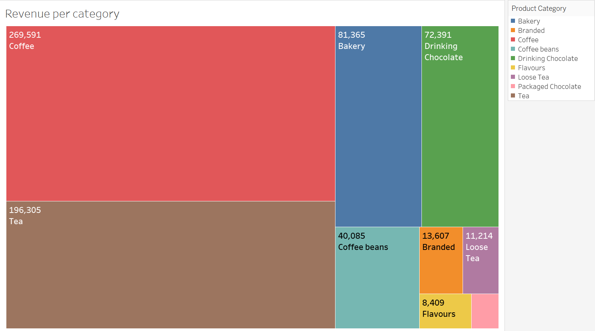
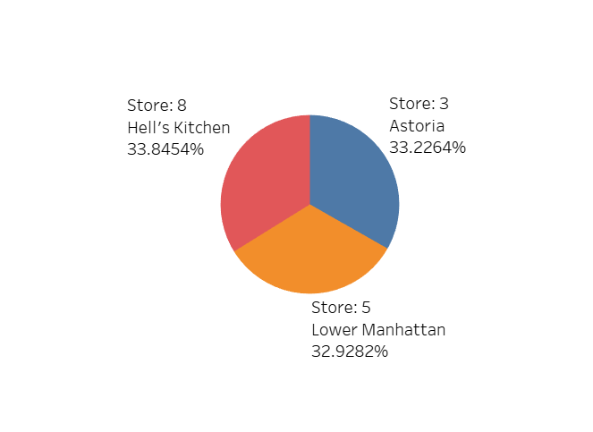
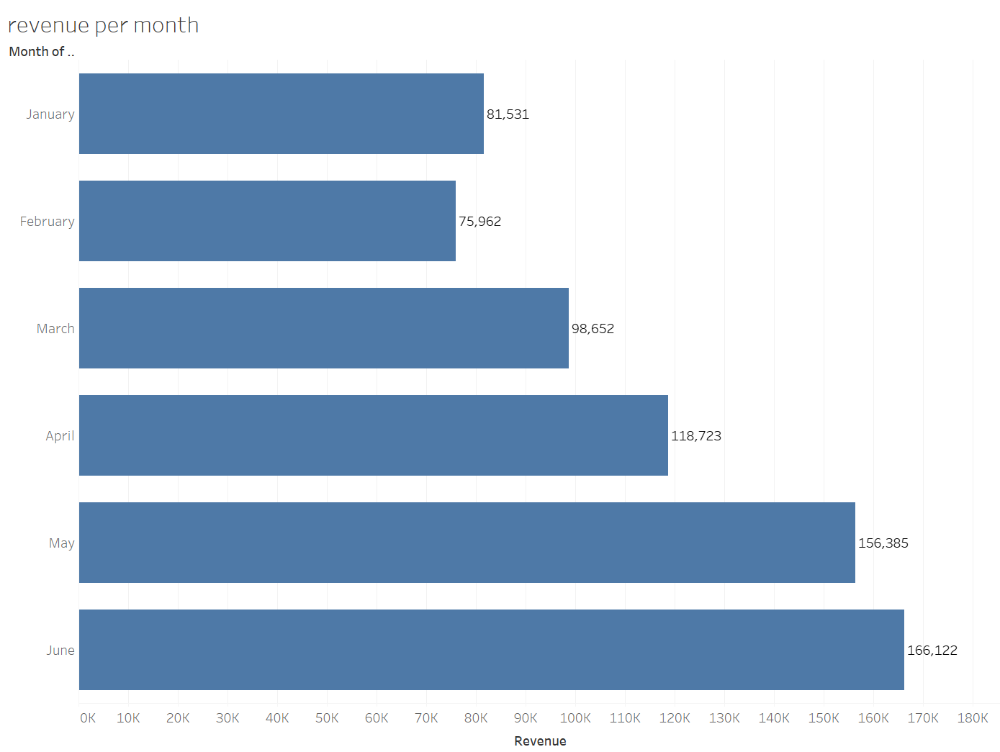
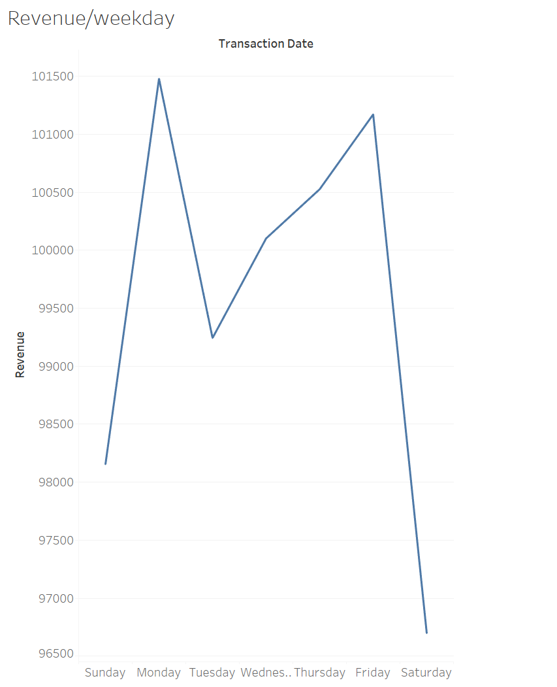
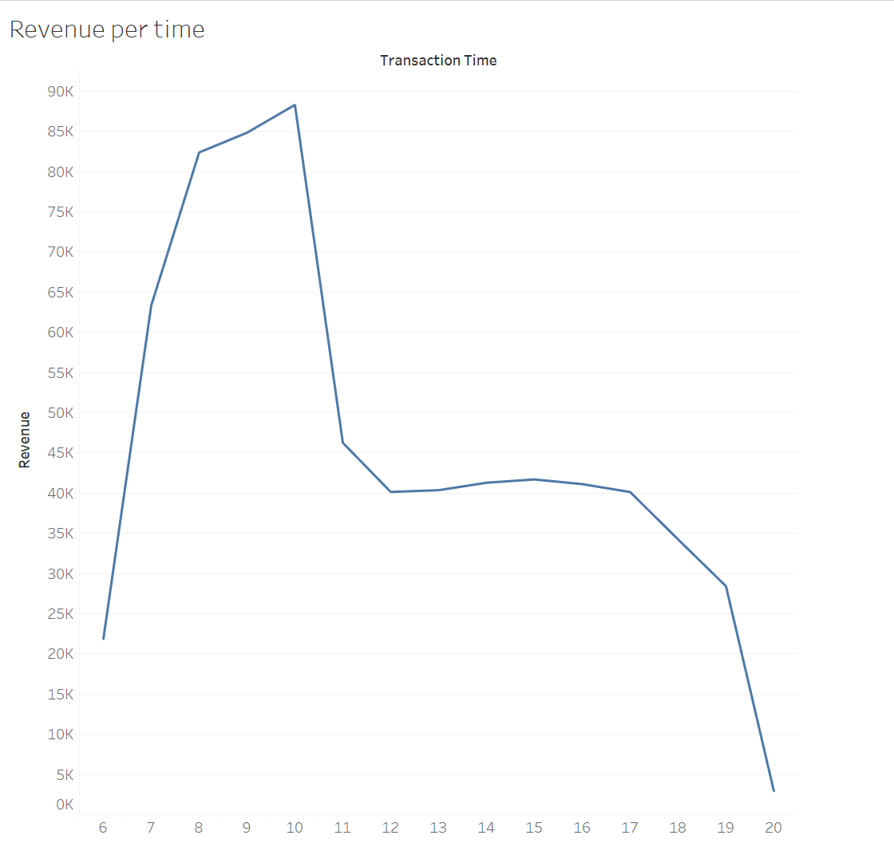
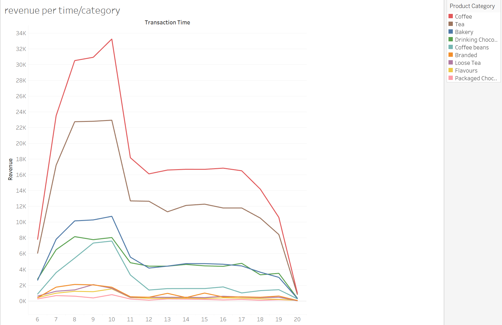
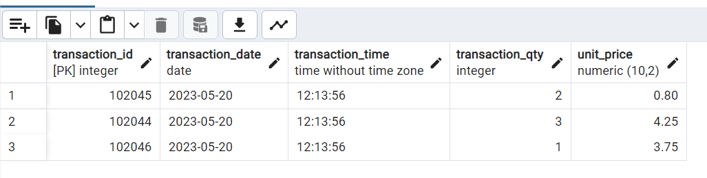
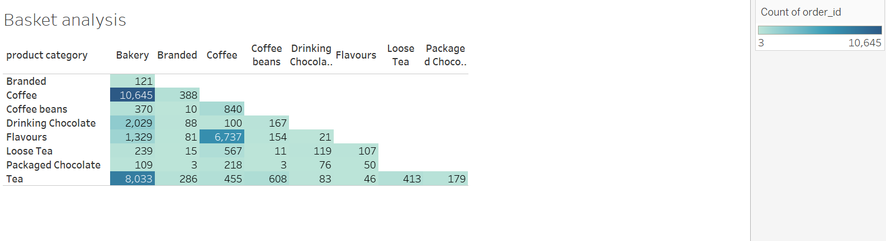
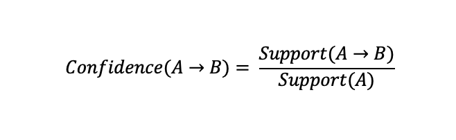

# Introduction

This **SQL** and **Tableau** project analyzes and gives insights about sales trends and patterns over time for a fictitious coffee shop called Maven Roasters, which operates out of three NYC locations. The project aims to assist the owner in decision-making through in-depth analysis and recommendations.

# About the data

The dataset under scrutiny comprises over 148,000 records (after data cleaning) spanning from the first six months of 2023. 

Using **SQL** and **Tableau**, insights from the dataset address the following three questions:

- Which category and store location generated the most revenue?
- How have Maven Roasters sales trended over time (e.g., revenue per days of the week, time of the day, etc.)?
- How often did customers purchase certain products together?

The dataset is sourced from **Kaggle**:  [Coffee Shop Sales](https://www.kaggle.com/datasets/ahmedabbas757/coffee-sales/data)

Link to Tableau public for visualizations: [click here](https://public.tableau.com/app/profile/dong.tran7019/viz/CoffeeShopAnalysisProject_17196758075890/Dashboard)

The SQL queries addressing these questions can be found here: [click here](sql_code)

# Tools and techniques

To fully explore the sales trends for the coffee shop, I utilised the following tools and techniques:

- **SQL**: for querying, cleaning, transforming, and analyzing sales data.
- **Tableau**: for visualizing findings and insights.
- **Market Basket Analysis**: a data mining technique that analyzes patterns of co-occurrence, helping the retailers know about the products frequently bought together (Kaur & Kang, 2016). The technique will be applied both in Tableau and SQL.
- **PostgreSQL**: the database management system used.

# Data exploration

Data cleaning is an important step prior to analysis. This section identifies any duplicates and null values in the dataset.

First, let's identify duplicates using `ROW_NUMBER()` function in combination with a `PARTITION BY` clause for all columns:

```sql
WITH duplicate AS
	(
	SELECT *,
		ROW_NUMBER() OVER(
            PARTITION BY 
            transaction_date, 
            transaction_time, 
            transaction_qty, 
            store_id, 
            store_location, 
            product_id, 
            unit_price, 
            product_category, 
            product_type, 
            product_detail) AS row_num
	FROM transactions
	)
SELECT * FROM duplicate
WHERE row_num > 1;
```
The ```WHERE``` clause identifies records that are repeated more than twice, which are duplicates in this context. 

Once we have a table listing all duplicates, we can delete them from our dataset (refer to: *[duplicate_handling.sql](sql_code\Duplicate_handling.sql)*).

Next, we check for *NULL* values. Following the query in *[Null_handling.sql](sql_code\Null_handling.sql)*, the result shows no null or missing values.

# Findings

### 1. Which category and store location generated the most revenue?



*Treemap chart: revenue per category*

Looking at the chart above, **Coffee** appeared to be the largest source of revenue for the shop, with $269,591 in sales, followed by **Tea** and **Bakery**. **Packed Chocolate** was the smallest category, with only $4,408 in revenue.

Overall, the performance of the three stores was fairly consistent, with each store contributing around 33% of the total revenue. Hell's Kitchen (store 8) stood out with $236,029 in sales (33.85% of total).




### 2. How have Maven Roasters sales trended over time?

To answer the question, let's first look at the store's revenue at each month:



The revenue tended to increase over time, except for Feb, which may partly be due to having fewer days compared to January (as Feb 2023 had only 28 days, while January had 31).

Next, I analyzed sales by weekdays using a line chart:



Looking at the chart, it is worth noticing that sales in Mondays and Fridays were the highest, while that figures of Saturdays and Sundays were the lowest. This might indicate that high sales days are usually at the start and end of work days (Monday and Friday), while low sales days are on the weekends.  

It's also important for the shop's manager to know which time of the day usually had the highest in sales, also known as peak hours:



The shop got busy right at opening time (6 a.m.), reaching its peak hour at 10 in the morning, with total revenue recorded at $88,302. It then formed a plateau after a significant downtrend in sales and finally plummeted to the lowest revenue point of the day at 8 p.m., or closing time.

To get a better view of the analysis, let's look at which product categories were demanded the most during different times of the day:



From the visualization, **Coffee** led with $33,258 in revenue at peak hour (10 a.m.), compared to **Tea**, the second highest in revenue, with $22,950 in sales at the same time. It's interesting to see that the majority of all categories followed a similar trend in sales, reaching the highest revenue at 10 a.m., except for **Drinking Chocolate** and **Branded** categories.

### 3. How often did customers purchase certain products together?

Now, it's getting more interesting to see which products are most frequently bought together. As mentioned in the ***Tools and Techniques***, a data mining method called 'Market Basket Analysis' will be applied to help us identify the number of times that each pair of different products were purchased together. 

This analysis offers a vast amount of benefits for retailers, or our cafe shop owner in this case study. Insights from this analysis help understand customer behaviour, improve inventory management, optimize sales and promotions, develop menu, and make strategic decisions (Kaur & Kang, 2016).

### **Process of Market Basket Analysis**

**1. Identify Orders:**

First, we need to identify all orders made within the given period. Each order will be assigned a unique order_id.

**2. Understanding the Dataset:**

The dataset contains a ```transaction_id``` column, which represents each item bought, not each order. Multiple transaction_id's can refer to the same ```transaction_date``` and ```transaction_time```, indicating they belong to the same order.

For instance, the image below shows three different transaction_id's that occur at the same transaction_date and transaction_time, indicating they are part of the same order.



**3. Creating the ```order_id``` Column**

To identify which records belong to which orders, I created an ```order_id``` column. Records with the same ```transaction_date``` and ```transaction_time``` are assigned the same order_id.

This can be achieved using the `DENSE_RANK() OVER()` function, ordered by `transaction_date` and `transaction_time`.

The new table called 'basket' will be used to store the updated data:

```sql
-- Step 1: Create the new table
CREATE TABLE basket (
	transaction_id INT,
    order_id INT,
    transaction_date DATE,
    transaction_time TIME,
	transaction_qty INT,
	product_id INT
);

-- Step 2: Insert data into the new table with dense rank
INSERT INTO basket (transaction_id, order_id, transaction_date, transaction_time, transaction_qty, product_id)
SELECT 
    transaction_id,
	DENSE_RANK() OVER (ORDER BY transaction_date, transaction_time) AS order_id,
    transaction_date,
    transaction_time,
	transaction_qty,
	product_id
FROM transactions;
```

By applying this process, we can accurately group items that are purchased at the same transaction date and time into their respective orders, allowing for a thorough market basket analysis.


### **The Analysis**

It's time to take a closer look at the basket analysis in visualizations using Tableau. As there are 29 different products given in the dataset, it's challenging to see everything in a single chart. Therefore, I first analyzed which product categories are most frequently bought together:




Having insights from the chart, it's clear that **Coffee** and **Bakery** are the two most frequently bought toghether categories, with 10,645 times occurences. The second most common pair of categories is **Tea** and **Bakery**, purchased together 8033 times. There was also a trend of adding flavors (such as syrups) to coffee, with 6,737 times recorded.

This is just the tip of the iceberg, however, since this analysis aims to bring more insightful information to the business owner. This is when **SQL** joins in to help us identify the exact products most frequently purchased together. This can be done by joining the table with itself (a self join) on the ```order_id```:

```sql
SELECT t1.product_id, t2.product_id, COUNT(*) AS times_bought_together
FROM basket t1
JOIN basket t2 ON t1.order_id = t2.order_id
WHERE t1.product_id <> t2.product_id AND -- Exclude all rows that combine only 1 product as a pair
	t1.product_id < t2.product_id -- a pair of 2 products will be listed in 2 records since order matters. We only need one of them
GROUP BY t1.product_id, t2.product_id
ORDER BY times_bought_together DESC 
LIMIT 10
```
| product_id | product_id (1) | times_bought_together |
|------------|----------------|-----------------------|
| 72         | 87             | 696                   |
| 40         | 65             | 396                   |
| 39         | 84             | 389                   |
| 41         | 84             | 379                   |
| 41         | 65             | 376                   |
| 39         | 64             | 371                   |
| 38         | 65             | 357                   |
| 41         | 63             | 355                   |
| 38         | 63             | 347                   |
| 37         | 63             | 345                   |

The chart seems powerful in showing all the details needed. To avoid manually checking which product matches which product id, I further converted the product_id to its corresponding product_detail using a CTE:

```sql
WITH pro_type AS 
	(
	SELECT DISTINCT product_id, product_detail FROM transactions ORDER BY product_id DESC
	)
SELECT pt1.product_detail, pt2.product_detail, COUNT(*) AS times_bought_together
FROM basket t1
JOIN basket t2 ON t1.order_id = t2.order_id
JOIN pro_type pt1 ON pt1.product_id = t1.product_id
JOIN pro_type pt2 ON pt2.product_id = t2.product_id
WHERE t1.product_id <> t2.product_id AND 
	t1.product_id < t2.product_id 
GROUP BY t1.product_id, t2.product_id, pt1.product_detail, pt2.product_detail
ORDER BY times_bought_together DESC
LIMIT 10
```
| product_detail      | product_detail (1)          | times_bought_together |
|---------------------|-----------------------------|-----------------------|
| Ginger Scone        | Ouro Brasileiro shot        | 696                   |
| Cappuccino          | Sugar Free Vanilla syrup    | 396                   |
| Latte Rg            | Chocolate syrup             | 389                   |
| Cappuccino Lg       | Chocolate syrup             | 379                   |
| Cappuccino Lg       | Sugar Free Vanilla syrup    | 376                   |
| Latte Rg            | Hazelnut syrup              | 371                   |
| Latte               | Sugar Free Vanilla syrup    | 357                   |
| Cappuccino Lg       | Carmel syrup                | 355                   |
| Latte               | Carmel syrup                | 347                   |
| Espresso shot       | Carmel syrup                | 345                   |

This approach works beatifully. Now, everything it's clear, our most frequently purchased products together were **Ginger Scone** and **Ouro Brasileiro shot** with 696 times recorded, categorized in **Bakery** and **Coffee** respectively. It is also worth noting the significant demand for adding flavours to coffee, with the most popular pair being **Cappuccino** and **Suger Free Vanilla syrrup**!

This can even be interpreted into statistical insights with the given input we've already had. Let's try to calculate the probability of buying Product A with Product B using the following formula:




Where:
- Support(A -> B) is the number of orders containing both products A and B.
- Support(A) is the number of orders containing product A.

 Let's try our top pair of product, which is 'Ouro Brasileiro shot' and 'Ginger Scone' as product A and B respectively. 

We've had the number of orders containing both products, which is 696, therefore, we have Support(A -> B) = 696. 

Now, using SQL, we can find the total number of orders that contain 'Ouro Brasileiro shot', or Support(A):

```sql
SELECT COUNT(DISTINCT order_id) from basket WHERE product_id = 87 
-- product_id for Ouro Brasileiro shot is 87
```

The query shows there were 2199 orders that had 'Ouro Brasileiro shot'. Applying all the input to the formula, we now have:

Confidence(Ouro Brasileiro shot -> Ouro Ginger Scone): 696/2199 =  0.32 = 32%

It means that whenever a customer buys an Ouro Brasileiro shot, there is a 32% likelihood that they will also buy a Ginger Scone. The same approach can be applied to other pair of products to calculate the probability of buying one product with another one. 

# Conclusion

### Key insights

**1. Top Revenue Sources:**

- Coffee is the largest revenue generator, followed by Tea and Bakery.
- Packed Chocolate contributes the least to revenue.

**2. Store Performance:**

- Each of the three stores contributes approximately one-third of the total revenue.
- Hell's Kitchen (store 8) stands out slightly with the highest sales.

**3. Sales Trends Over Time:**

- Revenue generally increases over time, except for a dip in February due to fewer days.
- Mondays and Fridays have the highest sales, while weekends see the lowest sales.
- Peak sales occur at 10 a.m., starting from 6 a.m. and gradually declining after 10 a.m.

**4. Market Basket Analysis:**

- The most frequently bought-together products are Ginger Scone and Ouro Brasileiro shot.
- There is a significant trend of adding flavors to coffee, particularly Cappuccino with Sugar Free Vanilla syrup.

### Recommendations:

**1. Enhance Coffee Offerings and Promotions:**

- Expand the coffee menu with new flavors and seasonal specials.
- Offer promotional bundles, such as discounts on frequently bought-together items.
- Implement a loyalty program to reward frequent coffee buyers.

**2. Optimize Store Operations Based on Peak Times:**

- Adjust staff scheduling to ensure adequate coverage during peak hours, particularly around 10 a.m.
- Manage inventory to ensure popular items are well-stocked during peak times.

**3. Leverage Data-Driven Insights for Product Placement and Marketing:**

- Place frequently bought-together items near each other to encourage cross-selling.
- Create targeted marketing campaigns based on popular product pairs.

**4. Improve Weekend Sales:**

- Introduce weekend specials or discounts to attract more customers.
- Create a family-friendly environment on weekends with activities or special menus for children.

**5. Monitor and Adjust Based on Trends:**

- Continuously monitor sales trends and adjust inventory, promotions, and staffing accordingly.
- Be prepared to adjust the menu and promotions based on seasonal trends and holidays.

By focusing on these insights and implementing the recommended actions, Maven Roasters can improve sales performance, customer satisfaction, and operational efficiency.

Link to Tableau public for visualizations: [click here](https://public.tableau.com/app/profile/dong.tran7019/viz/CoffeeShopAnalysisProject_17196758075890/Dashboard)

## REFERENCE

Kaur, M., & Kang, S. (2016). Market Basket Analysis: Identify the changing trends of market data using association rule mining. *Procedia computer science, 85*, 78-85.

