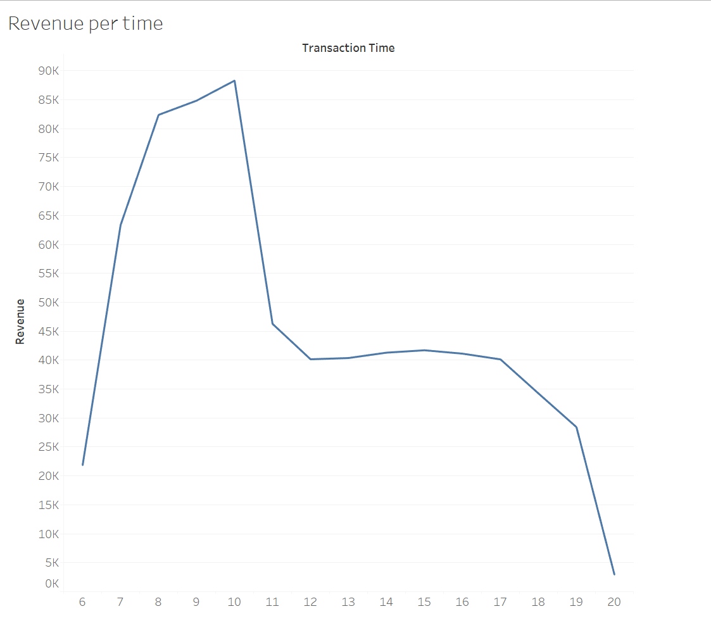
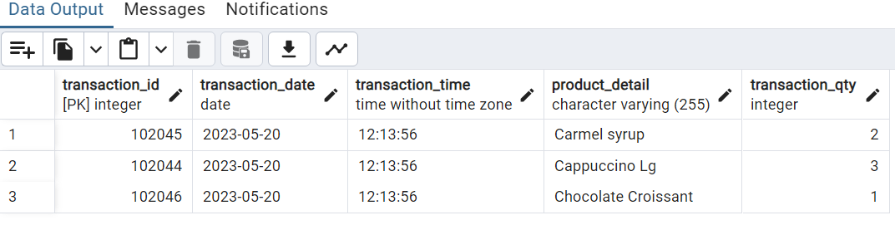

# Introduction

This **SQL** and **Tableau** project analyzes and gives insights about sales trends and patterns over time for a fictitious coffee shop called Maven Roasters, which is operated out of three NYC locations. The project is believed to help the owner in decision-making with its in-depth analysis and recommendations.

# About the data

The dataset under scrutiny comprises over 148,000 records (after data cleaning process) spanning from the first 6 months of 2023. 

With the application of **SQL** and **Tableau**, insights from the dataset will help identify the following three questions:

- Which category and store location offered the largest source of revenue?
- How have Maven Roasters sales trended over time (revenue per days of the week, time of the day, etc.)?
- How often did customers purchase certain products together?

The SQL queries addressing the problem: [click here](sql_code)

The dataset hails from Kaggle:  [Coffee Shop Sales](https://www.kaggle.com/datasets/ahmedabbas757/coffee-sales/data)

Link to Tableau public for visualizations: 

# Tools and techniques

In order to fully explore the sales trend for the coffee shop, I utilised the following important tools and techniques:

- **SQL**: for querying, cleaning, transforming, and analyzing of sales data.
- **Tableau**: for visualizations of findings and insights.
- **Market Basket Analysis**: a data mining technique that analyzes patterns of co-occurrence, helping the retailers know about the products frequently bought together (Kaur & Kang, 2016). The technique will be applied both in Tableau and SQL.
- **PostgreSQL**: database management system.

# Data exploration

Data cleaning is an important step prior to analysis. This section identifies any duplicates and null values in the dataset.

First, let's identify duplicates using ROW_NUMBER() function in combination with a PARTITION BY clause for all columns:

```sql
WITH duplicate AS
	(
	SELECT *,
		ROW_NUMBER() OVER(
            PARTITION BY 
            transaction_date, 
            transaction_time, 
            transaction_qty, 
            store_id, 
            store_location, 
            product_id, 
            unit_price, 
            product_category, 
            product_type, 
            product_detail) AS row_num
	FROM transactions
	)
SELECT * FROM duplicate
WHERE row_num > 1;
```
The ```WHERE``` clause identifies records that are repeated more than twice, which are duplicates in this context. 

Once we have a table of duplicates, we just need to delete all of them in our dataset (refer to: *[duplicate_handling.sql](sql_code\Duplicate_handling.sql)*).

Once we have removed all duplicates, it's now time to check for *NULL* values. Following the query in *[Null_handling.sql](sql_code\Null_handling.sql)*, the result does not contain any null or missing values.

# Findings

### 1. Which category and store location offered the largest source of revenue?


*Treemap chart: revenue per category*

Looking at the chart above, **Coffee** appeared to be the largest* source of revenue for the shop, with $269,591 in sales, followed by **Tea** and **Bakery**. **Packed Chocolate**, on the other hand, was the smallest category, with only $4,408 in revenue.

Overall, the performance of the 3 stores was fairly consistent, with each store contributed around 33% of the total revenue for the cafe. Hell's Kitchen (store 8) stood out compared to others with $236,029 in sales (33.85% of total).


### 2. How have Maven Roasters sales trended over time?

To answer the question, let's first look at the store's revenue at each month:


The revenue tended to increase over time, except for Feb, which might partly due to a lack of 3 days compared to Jan (as Feb 2023 had only 28 days, while Jan had 31 days).

Next, I dived in to identify which weekdays had the highest in sales using a line chart:


Looking at the chart, it is worth noticing that sales in Mondays and Fridays were the highest, while that figures of Saturdays and Sundays totally adversed. This might indicate that high sales days are usually the start and end of work days (Mon and Fri), while low sales days are the weekends.  

It's also important for the shop's manager to know which time of the day usually had the highest in sales, also known as peak hours:



As the shop got busy right at its opening time, which is 6 a.m., it soon reached its peak hour at 10 in the morning, with the total revenue recorded at this time was $88,302. It then formed a ... after a significant downtrend in sales and finally plummeted to the lowest revenue point of the day - 8 p.m. or at closing time.

To have a better view of the analysis, let's look at which product categories were demanded the most during different time points of the day:


From the visualization, **Coffee** was still the leader, with $33,258 in revenue at peak hour (10 a.m.), compared to that of **Tea** - the second highest in revenue, with  $22,950 in sales at the same time of the day. It's interesting to see that the majority of all categories had the same trend in sales when they all reached the highest points in revenue at 10 a.m., except for **Drinking Chocolate** and **Branded** categories.

### 3. How often did customers purchase certain products together?

Now, it's getting more interesting to see which products are most frequently bought together. As mentioned in the ***Tools and Techniques***, a data mining method called 'Market Basket Analysis' will be applied to help us identify the number of times that each pair of different products were purchased together. 

This analysis offers a vast amount of benefits for retailers, or our cafe shop owner in this case study. The insights from this analysis might help understanding customer behaviour, efficiency inventory management, sales and promotions, menu development, and strategic decisions (Kaur & Kang, 2016).

### **Process of Market Basket Analysis**

**1. Identify Orders:**

First, we need to identify all orders made within the given period. Each order will be assigned a unique order_id.

**2. Understanding the Dataset:**

The dataset contains a ```transaction_id``` column, which represents each item bought, not each order. Multiple transaction_id's can refer to the same ```transaction_date``` and ```transaction_time```, indicating they belong to the same order.

For instance, the image below shows three different transaction_id's that occur at the same transaction_date and transaction_time, indicating they are part of the same order.



**3. Creating the ```order_id``` Column**

To identify which records belong to which orders, I created an ```order_id``` column. Records with the same ```transaction_date``` and ```transaction_time``` are assigned the same order_id.

This can be achieved using the **DENSE_RANK() OVER()** function, ordered by transaction_date and transaction_time.

The new table called 'basket' will be used to store the updated data:

```sql
-- Step 1: Create the new table
CREATE TABLE basket (
	transaction_id INT,
    order_id INT,
    transaction_date DATE,
    transaction_time TIME,
	transaction_qty INT,
	product_id INT
);

-- Step 2: Insert data into the new table with dense rank
INSERT INTO basket (transaction_id, order_id, transaction_date, transaction_time, transaction_qty, product_id)
SELECT 
    transaction_id,
	DENSE_RANK() OVER (ORDER BY transaction_date, transaction_time) AS order_id,
    transaction_date,
    transaction_time,
	transaction_qty,
	product_id
FROM transactions;
```

By applying this process, we can accurately group items into their respective orders, allowing for a thorough market basket analysis.


### **The Analysis**

It's time to take a closer look at the basket analysis in visualizations using Tableau. As there are 29 different products given in the dataset, it would be hard to see everything in a single chart. Therefore, I will first analyze which product categories are most frequently bought together:


Having insights from the chart, it's clear that **Coffee** and **Bakery** are the two most frequently bought toghether categories, with 10,645 times recorded. The second best pair of categories is **Tea** and **Bakery**, when they were purchased together 8033 times. There was also a trend in adding flavors (such as syrups) to coffee, with 6,737 times recorded.

This is just the tip of the iceberg, however, when this analysis aims to bring more insightful information to the business owner. This is when **SQL** joins in to help us identify the exact products are most purchased in the same order. This can be done by joining the table with itself (a self join) on the same ```order_id```:

```sql
SELECT t1.product_id, t2.product_id, COUNT(*) AS times_bought_together
FROM basket t1
JOIN basket t2 ON t1.order_id = t2.order_id
WHERE t1.product_id <> t2.product_id AND -- Exclude all rows that combine only 1 product as a pair
	t1.product_id < t2.product_id -- a pair of 2 products will be listed in 2 records since order matters. We only need one of them
GROUP BY t1.product_id, t2.product_id
ORDER BY times_bought_together DESC 
LIMIT 10
```
| product_id | product_id (1) | times_bought_together |
|------------|----------------|-----------------------|
| 72         | 87             | 696                   |
| 40         | 65             | 396                   |
| 39         | 84             | 389                   |
| 41         | 84             | 379                   |
| 41         | 65             | 376                   |
| 39         | 64             | 371                   |
| 38         | 65             | 357                   |
| 41         | 63             | 355                   |
| 38         | 63             | 347                   |
| 37         | 63             | 345                   |

The chart seems power in showing all the details needed. But I don't want the reader to manually check what product detail matches with which product id, so I do one more step to convert the product_id to its correspond product_detail:

```sql
WITH pro_type AS 
	(
	SELECT DISTINCT product_id, product_detail FROM transactions ORDER BY product_id DESC
	)
SELECT pt1.product_detail, pt2.product_detail, COUNT(*) AS times_bought_together
FROM basket t1
JOIN basket t2 ON t1.order_id = t2.order_id
JOIN pro_type pt1 ON pt1.product_id = t1.product_id
JOIN pro_type pt2 ON pt2.product_id = t2.product_id
WHERE t1.product_id <> t2.product_id AND 
	t1.product_id < t2.product_id 
GROUP BY t1.product_id, t2.product_id, pt1.product_detail, pt2.product_detail
ORDER BY times_bought_together DESC
LIMIT 10
```
| product_detail      | product_detail (1)          | times_bought_together |
|---------------------|-----------------------------|-----------------------|
| Ginger Scone        | Ouro Brasileiro shot        | 696                   |
| Cappuccino          | Sugar Free Vanilla syrup    | 396                   |
| Latte Rg            | Chocolate syrup             | 389                   |
| Cappuccino Lg       | Chocolate syrup             | 379                   |
| Cappuccino Lg       | Sugar Free Vanilla syrup    | 376                   |
| Latte Rg            | Hazelnut syrup              | 371                   |
| Latte               | Sugar Free Vanilla syrup    | 357                   |
| Cappuccino Lg       | Carmel syrup                | 355                   |
| Latte               | Carmel syrup                | 347                   |
| Espresso shot       | Carmel syrup                | 345                   |

This works beatifully. Now, everything it's clear, our most frequently purchased products together were **Ginger Scone** and **Ouro Brasileiro shot** with 696 times recorded, which categorized in **Bakery** and **Coffee** respectively. It is also worth noticing there was a significant demand for flavors adding to coffee, with the most popular pair was **Cappuccino** and **Suger Free Vanilla syrrup**!

# Conclusion

